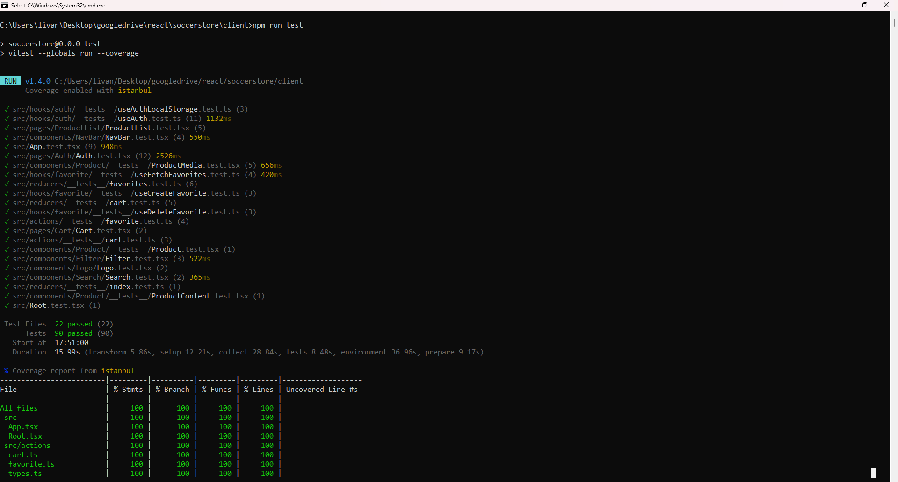
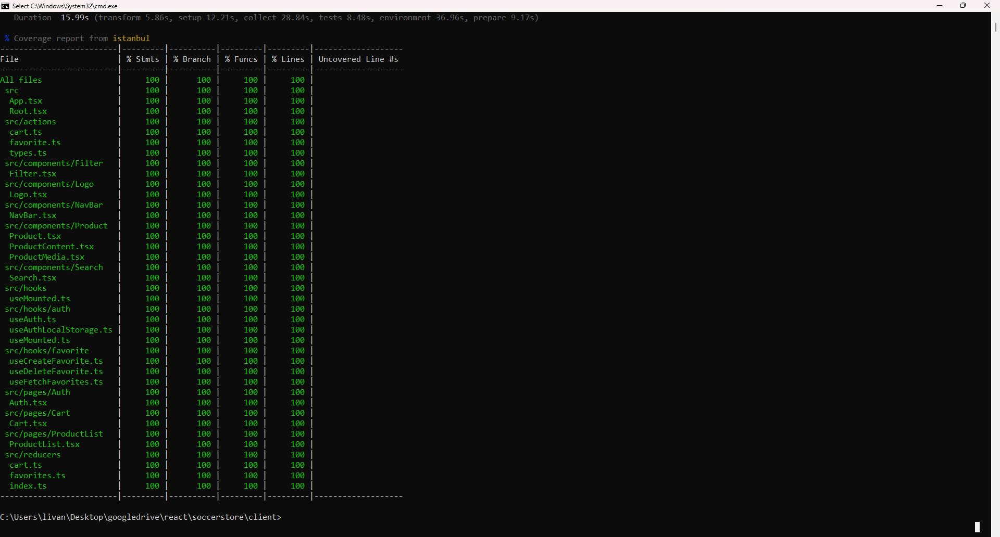
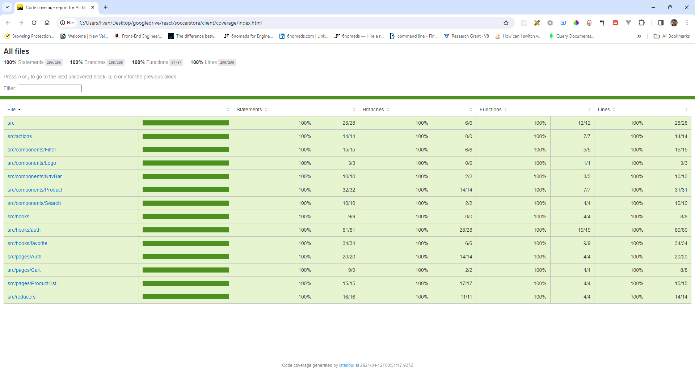

# Development:

Steps to launch the web app.

1- Clone this repo.

2- Install Node.js version v20.10.0

3- Open a terminal and start the express API server.

soccerstore> cd server

soccerstore\server> npm run start

4- Open a second terminal and start the development server.

soccerstore> cd client

soccerstore\client> npm run dev

5- In order to run the unit tests open a third terminal.

soccerstore> cd client

soccerstore\client> npm run test

6- If you make changes in any of the soccerstore\server> files you need to run the following command: soccerstore\server> npm run build

7- I use MongoDB Atlas for the databases. For this I created the file soccerstore\server\\.env with the following keys:

PORT=4000  
MONGO_URI=url to your MongoDB Atlas database  
SECRET=secret key for the encryption and decryption of the users passwords. Could be something like: ksdajfkdsjaksjf

 

This is an ongoing project. Thanks!

 
 

https://github.com/lojito/soccerstore/assets/46691447/7665fc4a-3c33-43bd-84db-3ff07afd8047

https://github.com/lojito/soccerstore/assets/46691447/00d9c018-255d-44c9-9ea0-8e9a6f3b4ea8

https://github.com/lojito/soccerstore/assets/46691447/c392965f-d7af-479e-a194-d83d9df82edb

https://github.com/lojito/soccerstore/assets/46691447/e9ea46da-d3aa-41c1-8453-4fc5b109da88

https://github.com/lojito/soccerstore/assets/46691447/b62eef00-2119-481b-a3f5-4a7b2ad80f5a

